# Multi-Tenant Solution Architecture

GoClaw is a multi-tenant AI agent gateway. This document describes the isolation architecture, authentication model, and data flow for integrators building on top of GoClaw.

---

## System Overview

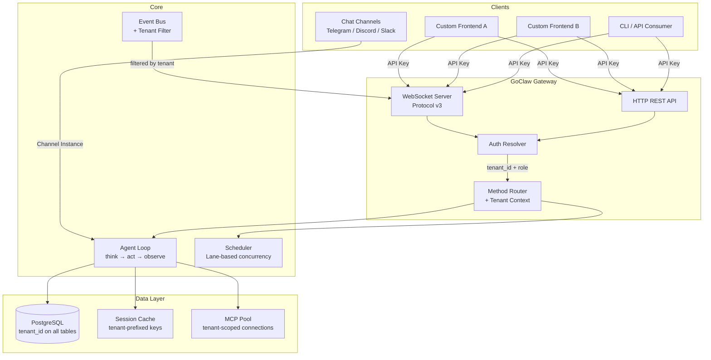

---

## Tenant Model

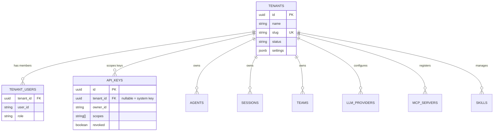

**Master Tenant**: UUID `0193a5b0-7000-7000-8000-000000000001`. All legacy data defaults here. Single-tenant setups work unchanged — everything under master.

**40+ tables** carry `tenant_id` with NOT NULL constraint + foreign key to `tenants(id)`. Exception: `api_keys.tenant_id` is nullable (NULL = system-level cross-tenant key).

---

## Authentication Flow

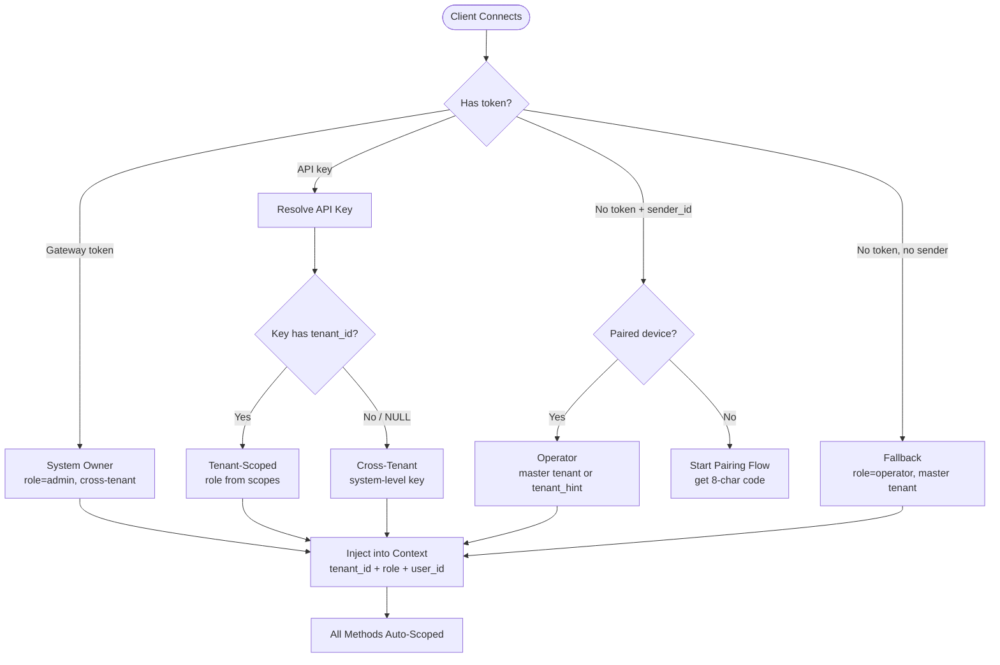

| Auth Path | Role | Tenant | Cross-Tenant |
|-----------|------|--------|:---:|
| Gateway token | admin | all | ✓ |
| API key (tenant-bound) | from scopes | key's tenant | ✗ |
| API key (system-level) | from scopes | all | ✓ |
| Browser pairing | operator | master (or hint) | ✗ |
| Fallback (no token) | operator | master | ✗ |

---

## Authorization — Role & Scope Model

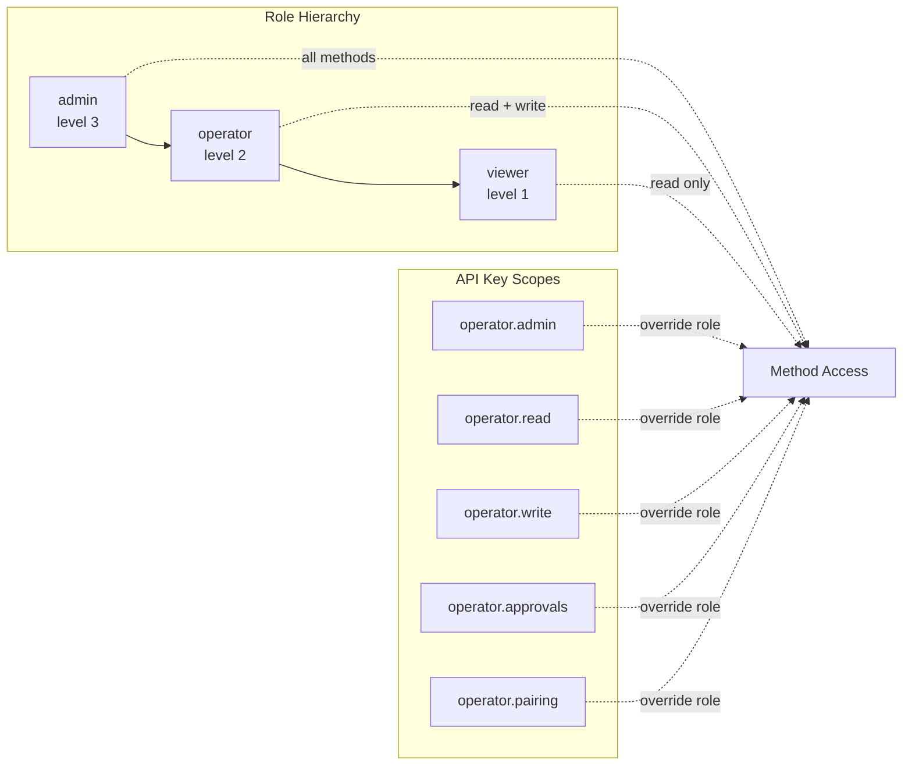

**Role determines base access**. API key scopes optionally narrow it further. Admin methods (config, agent CRUD, API key management) require `admin` role. Chat/session operations require `operator`. Read-only browsing requires `viewer`.

---

## WebSocket Protocol (v3)

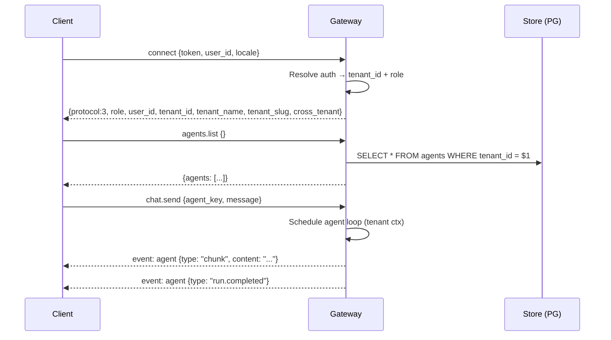

**Frame types**: `req` (client→server), `res` (server→client), `event` (async push).
**Tenant context**: Injected after `connect`, applied to ALL subsequent method calls automatically.
**Events**: Server-side filtered — client only receives events matching its tenant. Fail-closed: unknown tenant events are blocked.

---

## Event Filtering

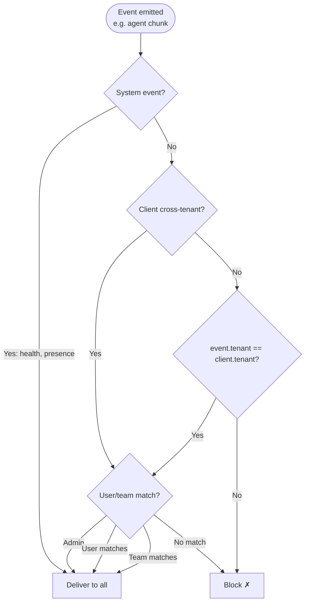

**Guarantee**: A tenant-scoped client **never** receives events from another tenant. The UI does not need to implement client-side filtering.

---

## Data Isolation

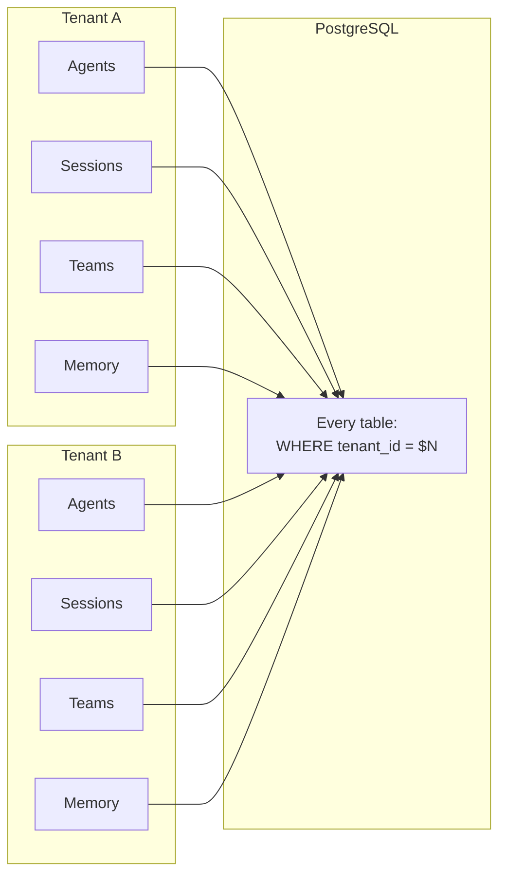

**Enforcement layers**:

| Layer | Mechanism |
|-------|-----------|
| SQL queries | `WHERE tenant_id = $N` on all SELECT/UPDATE/DELETE |
| INSERT | `tenantIDForInsert(ctx)` assigns tenant from context |
| UPDATE | `execMapUpdateWhereTenant()` prevents cross-tenant writes |
| Cache | Session keys prefixed with `tenantID:` |
| MCP Pool | Connection keys: `tenantID/serverName` |
| Fail-closed | Missing tenant → error (not unfiltered query) |

---

## Channel → Agent Loop Propagation

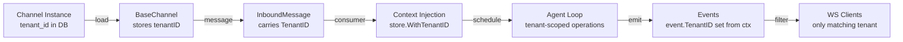

Chat channels (Telegram, Discord, Slack, etc.) inherit `tenant_id` from their channel instance configuration. Every message entering the agent loop carries tenant context end-to-end.

---

## Provider Registry

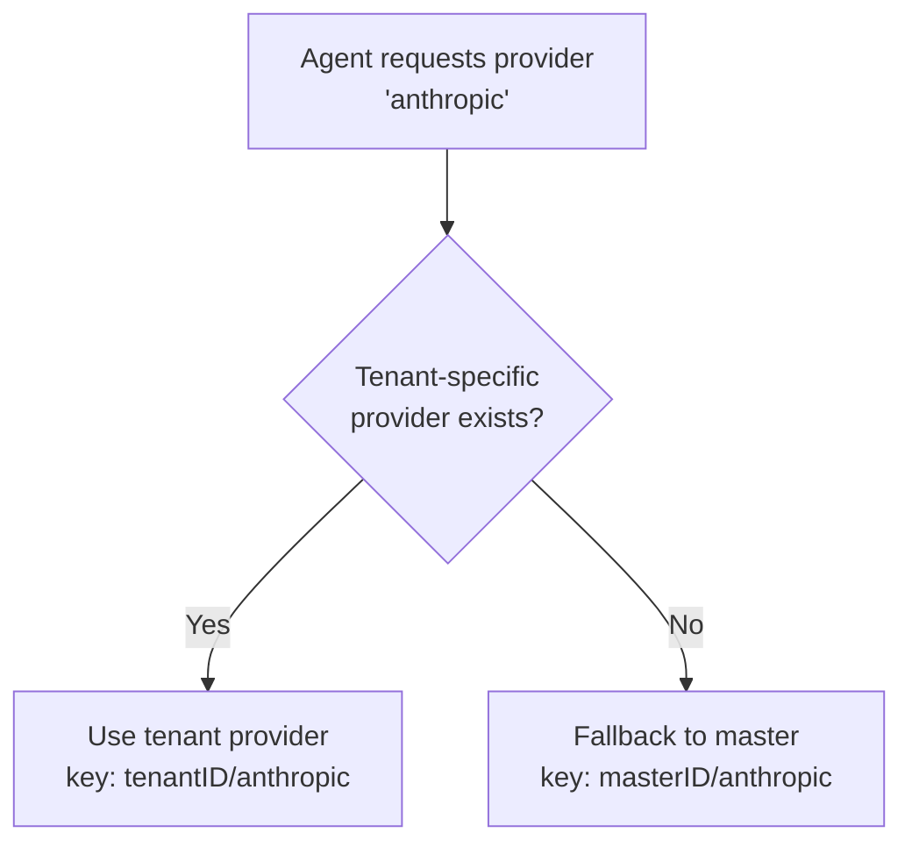

LLM providers use compound key `tenantID/providerName`. Tenant-specific providers (custom API keys) override master tenant defaults. This allows per-tenant provider configuration without duplicating all providers.

---

## Tenant Management

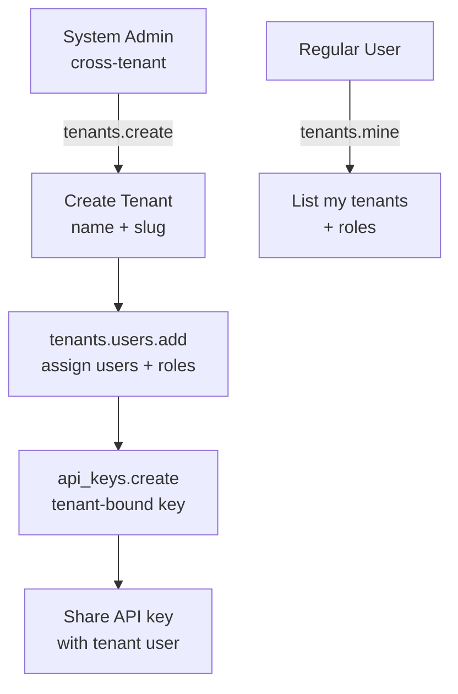

**API Methods**:
- `tenants.list` / `tenants.get` / `tenants.create` / `tenants.update` — admin only (cross-tenant)
- `tenants.users.list` / `tenants.users.add` / `tenants.users.remove` — admin only
- `tenants.mine` — any user, returns own tenant memberships

**Tenant user roles**: owner > admin > operator > member > viewer

---

## Integration Pattern

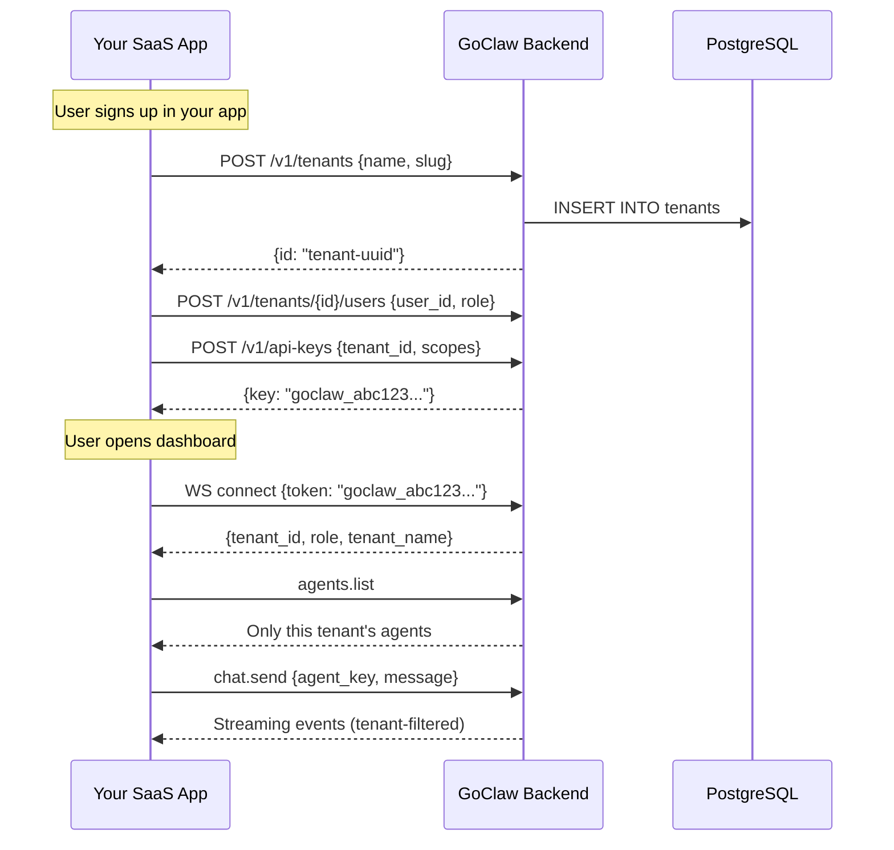

**GoClaw as pure backend**: Your SaaS handles user auth, billing, onboarding. GoClaw handles AI agents, chat, sessions, tools, MCP. API keys bridge the two systems — each key binds a user to a tenant with specific permissions.

---

## Security Guarantees

| Threat | Mitigation |
|--------|-----------|
| Cross-tenant data access | All SQL queries include `WHERE tenant_id = $N` |
| Event leakage | Server-side `clientCanReceiveEvent` blocks mismatched tenants |
| Missing tenant context | Fail-closed: returns error, never unfiltered data |
| API key theft | Keys are hashed (SHA-256) at rest; only prefix shown in UI |
| Tenant impersonation | Tenant resolved from API key, not client-supplied header |
| Privilege escalation | Role derived from API key scopes, not client claims |

---

## Migration from Single-Tenant

No changes required. Single-tenant deployments operate entirely under the master tenant. All existing data, agents, sessions, and configurations remain accessible. Multi-tenant features activate only when new tenants are created via the management API.
